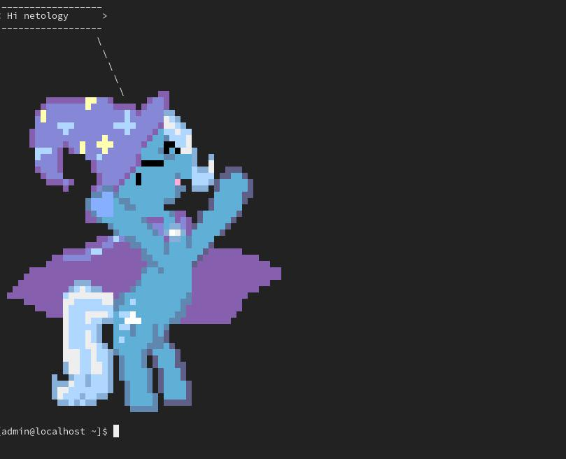

# Домашнее задание к занятию "5.4. Практические навыки работы с Docker"
## Задача 1
Ни на последней Ubuntu (нет ppa репозитория), ни на Арче последнем(проблемы с правами на /var/lib/pacman) запустить не удалось. Поэтому проверил на Ubuntu 18.04.  
Dockerfile:

        FROM archlinux:base-20201129.0.10056
        RUN pacman -Sy ponysay --noconfirm && \
            pacman -Sy --noconfirm glibc
        ENTRYPOINT ["/usr/bin/ponysay"]
        CMD ["Hey, netology"]

    docker pull ottvladimir/ponysay_arch
    
## Задача 2 Решение

### Dockerfile Amazoncorretto:

        FROM amazoncorretto:latest

        RUN yum update -y && \
            yum install -y wget && \
            yum install -y java-11-amazon-corretto
        RUN wget https://get.jenkins.io/war-stable/2.277.3/jenkins.war -nv
        RUN yum clean all
        ENTRYPOINT ["/usr/bin/java", "-jar", "jenkins.war"]

        EXPOSE 8080/tcp
        EXPOSE 50000/tcp
        
        docker pull ottvladimir/amazoncorretto:ver1

###log amazoncorretto
        
        $ docker run -it -p 8080:8080 ottvladimir/amazoncorretto:latest 
        Running from: /jenkins.war
        webroot: $user.home/.jenkins
        2021-05-18 12:37:45.374+0000 [id=1]     INFO    org.eclipse.jetty.util.log.Log#initialized: Logging initialized @485ms to org.eclipse.jetty.util.log.JavaUtilLog
        2021-05-18 12:37:45.546+0000 [id=1]     INFO    winstone.Logger#logInternal: Beginning extraction from war file
        2021-05-18 12:37:47.381+0000 [id=1]     WARNING o.e.j.s.handler.ContextHandler#setContextPath: Empty contextPath
        2021-05-18 12:37:47.448+0000 [id=1]     INFO    org.eclipse.jetty.server.Server#doStart: jetty-9.4.39.v20210325; built: 2021-03-25T14:42:11.471Z; git: 9fc7ca5a922f2a37b84ec9dbc26a5168cee7e667; jvm 1.8.0_292-b10
        2021-05-18 12:37:47.819+0000 [id=1]     INFO    o.e.j.w.StandardDescriptorProcessor#visitServlet: NO JSP Support for /, did not find org.eclipse.jetty.jsp.JettyJspServlet
        2021-05-18 12:37:47.872+0000 [id=1]     INFO    o.e.j.s.s.DefaultSessionIdManager#doStart: DefaultSessionIdManager workerName=node0
        2021-05-18 12:37:47.873+0000 [id=1]     INFO    o.e.j.s.s.DefaultSessionIdManager#doStart: No SessionScavenger set, using defaults
        2021-05-18 12:37:47.875+0000 [id=1]     INFO    o.e.j.server.session.HouseKeeper#startScavenging: node0 Scavenging every 660000ms
        2021-05-18 12:37:48.631+0000 [id=1]     INFO    hudson.WebAppMain#contextInitialized: Jenkins home directory: /root/.jenkins found at: $user.home/.jenkins
        2021-05-18 12:37:48.776+0000 [id=1]     INFO    o.e.j.s.handler.ContextHandler#doStart: Started w.@3aacf32a{Jenkins v2.277.3,/,file:///root/.jenkins/war/,AVAILABLE}{/root/.jenkins/war}
        2021-05-18 12:37:48.808+0000 [id=1]     INFO    o.e.j.server.AbstractConnector#doStart: Started ServerConnector@57db2b13{HTTP/1.1, (http/1.1)}{0.0.0.0:8080}
        2021-05-18 12:37:48.809+0000 [id=1]     INFO    org.eclipse.jetty.server.Server#doStart: Started @3920ms
        2021-05-18 12:37:48.818+0000 [id=23]    INFO    winstone.Logger#logInternal: Winstone Servlet Engine running: controlPort=disabled
        2021-05-18 12:37:50.512+0000 [id=30]    INFO    jenkins.InitReactorRunner$1#onAttained: Started initialization
        2021-05-18 12:37:50.581+0000 [id=41]    INFO    jenkins.InitReactorRunner$1#onAttained: Listed all plugins
        2021-05-18 12:37:52.474+0000 [id=41]    INFO    jenkins.InitReactorRunner$1#onAttained: Prepared all plugins
        2021-05-18 12:37:52.493+0000 [id=39]    INFO    jenkins.InitReactorRunner$1#onAttained: Started all plugins
        2021-05-18 12:37:52.516+0000 [id=29]    INFO    jenkins.InitReactorRunner$1#onAttained: Augmented all extensions
        2021-05-18 12:37:53.890+0000 [id=31]    INFO    jenkins.InitReactorRunner$1#onAttained: System config loaded
        2021-05-18 12:37:53.891+0000 [id=43]    INFO    jenkins.InitReactorRunner$1#onAttained: System config adapted
        2021-05-18 12:37:53.892+0000 [id=33]    INFO    jenkins.InitReactorRunner$1#onAttained: Loaded all jobs
        2021-05-18 12:37:53.894+0000 [id=39]    INFO    jenkins.InitReactorRunner$1#onAttained: Configuration for all jobs updated
        2021-05-18 12:37:53.918+0000 [id=56]    INFO    hudson.model.AsyncPeriodicWork#lambda$doRun$0: Started Download metadata
        2021-05-18 12:37:53.930+0000 [id=56]    INFO    hudson.util.Retrier#start: Attempt #1 to do the action check updates server
        2021-05-18 12:37:54.439+0000 [id=34]    INFO    jenkins.install.SetupWizard#init: 
        
        *************************************************************
        *************************************************************
        *************************************************************
        
        Jenkins initial setup is required. An admin user has been created and a password generated.
        Please use the following password to proceed to installation:
        
        7b29d38410b34672989c8fdd95c14fbe
        
        This may also be found at: /root/.jenkins/secrets/initialAdminPassword
        
        *************************************************************
        *************************************************************
        *************************************************************
        
        2021-05-18 12:38:06.586+0000 [id=36]    INFO    jenkins.InitReactorRunner$1#onAttained: Completed initialization
        2021-05-18 12:38:06.618+0000 [id=22]    INFO    hudson.WebAppMain$3#run: Jenkins is fully up and running
        2021-05-18 12:38:06.729+0000 [id=56]    INFO    h.m.DownloadService$Downloadable#load: Obtained the updated data file for hudson.tasks.Maven.MavenInstaller
        2021-05-18 12:38:06.733+0000 [id=56]    INFO    hudson.util.Retrier#start: Performed the action check updates server successfully at the attempt #1
        2021-05-18 12:38:06.737+0000 [id=56]    INFO    hudson.model.AsyncPeriodicWork#lambda$doRun$0: Finished Download metadata. 12,817 ms

### Dockerfile Ubuntu:

        FROM ubuntu:latest

        RUN apt-get update && \
            apt-get install -y wget && \
            apt-get install -y openjdk-11-jdk
        RUN wget https://get.jenkins.io/war-stable/2.277.3/jenkins.war -nv
        RUN apt-get clean && rm -rf /var/lib/apt/lists/*
        ENTRYPOINT ["/usr/bin/java", "-jar", "jenkins.war"]

        EXPOSE 8080/tcp
        EXPOSE 50000/tcp
        
        
        docker pull ottvladimir/ubuntu:ver2

###Лог Ubuntu
        $ docker run -it -p 8080:8080 ottvladimir/ubuntu:ver2 
        Running from: /jenkins.war
        webroot: $user.home/.jenkins
        2021-05-18 12:50:20.108+0000 [id=1]     INFO    org.eclipse.jetty.util.log.Log#initialized: Logging initialized @763ms to org.eclipse.jetty.util.log.JavaUtilLog
        2021-05-18 12:50:20.242+0000 [id=1]     INFO    winstone.Logger#logInternal: Beginning extraction from war file
        2021-05-18 12:50:21.782+0000 [id=1]     WARNING o.e.j.s.handler.ContextHandler#setContextPath: Empty contextPath
        2021-05-18 12:50:21.855+0000 [id=1]     INFO    org.eclipse.jetty.server.Server#doStart: jetty-9.4.39.v20210325; built: 2021-03-25T14:42:11.471Z; git: 9fc7ca5a922f2a37b84ec9dbc26a5168cee7e667; jvm 11.0.11+9-Ubuntu-0ubuntu2.20.04
        2021-05-18 12:50:22.382+0000 [id=1]     INFO    o.e.j.w.StandardDescriptorProcessor#visitServlet: NO JSP Support for /, did not find org.eclipse.jetty.jsp.JettyJspServlet
        2021-05-18 12:50:22.440+0000 [id=1]     INFO    o.e.j.s.s.DefaultSessionIdManager#doStart: DefaultSessionIdManager workerName=node0
        2021-05-18 12:50:22.441+0000 [id=1]     INFO    o.e.j.s.s.DefaultSessionIdManager#doStart: No SessionScavenger set, using defaults
        2021-05-18 12:50:22.443+0000 [id=1]     INFO    o.e.j.server.session.HouseKeeper#startScavenging: node0 Scavenging every 660000ms
        2021-05-18 12:50:23.309+0000 [id=1]     INFO    hudson.WebAppMain#contextInitialized: Jenkins home directory: /root/.jenkins found at: $user.home/.jenkins
        2021-05-18 12:50:23.623+0000 [id=1]     INFO    o.e.j.s.handler.ContextHandler#doStart: Started w.@5246a3b3{Jenkins v2.277.3,/,file:///root/.jenkins/war/,AVAILABLE}{/root/.jenkins/war}
        2021-05-18 12:50:23.660+0000 [id=1]     INFO    o.e.j.server.AbstractConnector#doStart: Started ServerConnector@15713d56{HTTP/1.1, (http/1.1)}{0.0.0.0:8080}
        2021-05-18 12:50:23.667+0000 [id=1]     INFO    org.eclipse.jetty.server.Server#doStart: Started @4323ms
        2021-05-18 12:50:23.668+0000 [id=25]    INFO    winstone.Logger#logInternal: Winstone Servlet Engine running: controlPort=disabled
        2021-05-18 12:50:24.158+0000 [id=32]    INFO    jenkins.InitReactorRunner$1#onAttained: Started initialization
        2021-05-18 12:50:24.190+0000 [id=33]    INFO    jenkins.InitReactorRunner$1#onAttained: Listed all plugins
        WARNING: An illegal reflective access operation has occurred
        WARNING: Illegal reflective access by com.google.inject.internal.cglib.core.$ReflectUtils$2 (file:/root/.jenkins/war/WEB-INF/lib/guice-4.0.jar) to method java.lang.ClassLoader.defineClass(java.lang.String,byte[],int,int,java.security.ProtectionDomain)
        WARNING: Please consider reporting this to the maintainers of com.google.inject.internal.cglib.core.$ReflectUtils$2
        WARNING: Use --illegal-access=warn to enable warnings of further illegal reflective access operations
        WARNING: All illegal access operations will be denied in a future release
        2021-05-18 12:50:26.309+0000 [id=35]    INFO    jenkins.InitReactorRunner$1#onAttained: Prepared all plugins
        2021-05-18 12:50:26.341+0000 [id=40]    INFO    jenkins.InitReactorRunner$1#onAttained: Started all plugins
        2021-05-18 12:50:26.372+0000 [id=40]    INFO    jenkins.InitReactorRunner$1#onAttained: Augmented all extensions
        2021-05-18 12:50:27.537+0000 [id=43]    INFO    jenkins.InitReactorRunner$1#onAttained: System config loaded
        2021-05-18 12:50:27.540+0000 [id=40]    INFO    jenkins.InitReactorRunner$1#onAttained: System config adapted
        2021-05-18 12:50:27.541+0000 [id=33]    INFO    jenkins.InitReactorRunner$1#onAttained: Loaded all jobs
        2021-05-18 12:50:27.542+0000 [id=33]    INFO    jenkins.InitReactorRunner$1#onAttained: Configuration for all jobs updated
        2021-05-18 12:50:27.566+0000 [id=61]    INFO    hudson.model.AsyncPeriodicWork#lambda$doRun$0: Started Download metadata
        2021-05-18 12:50:27.603+0000 [id=61]    INFO    hudson.util.Retrier#start: Attempt #1 to do the action check updates server
        2021-05-18 12:50:28.292+0000 [id=33]    INFO    jenkins.install.SetupWizard#init: 
        
        *************************************************************
        *************************************************************
        *************************************************************
        
        Jenkins initial setup is required. An admin user has been created and a password generated.
        Please use the following password to proceed to installation:
        
        5a2d77c70dcb4aca9e7eab56feafdf04
        
        This may also be found at: /root/.jenkins/secrets/initialAdminPassword
        
        *************************************************************
        *************************************************************
        *************************************************************
        
        2021-05-18 12:50:46.260+0000 [id=33]    INFO    jenkins.InitReactorRunner$1#onAttained: Completed initialization
        2021-05-18 12:50:46.293+0000 [id=24]    INFO    hudson.WebAppMain$3#run: Jenkins is fully up and running
        2021-05-18 12:50:46.389+0000 [id=61]    INFO    h.m.DownloadService$Downloadable#load: Obtained the updated data file for hudson.tasks.Maven.MavenInstaller
        2021-05-18 12:50:46.390+0000 [id=61]    INFO    hudson.util.Retrier#start: Performed the action check updates server successfully at the attempt #1
        2021-05-18 12:50:46.400+0000 [id=61]    INFO    hudson.model.AsyncPeriodicWork#lambda$doRun$0: Finished Download metadata. 18,831 ms

## Задача 3   Решение

Листинг докера

        FROM node
        RUN git clone https://github.com/simplicitesoftware/nodejs-demo.git && \
        cd /nodejs-demo && \
        sed -i "s/localhost/0.0.0.0/g" app.js && \
        npm audit fix && \
        npm install

        WORKDIR /nodejs-demo

        CMD ["npm", "start"]

        EXPOSE 3000

Запускаю
        
        docker build -t ottvladimir/node .
        docker run -d -p 3000:3000 ottvladimir/node

Собираю Ubuntu
        
        FROM ubuntu
        RUN apt-get update && apt-get install -y curl
        docker run -d -it --name=ubuntu ottvladimir/ubuntu_curl
Создаю сеть  

        docker network create node
        $ docker network ls
        NETWORK ID     NAME      DRIVER    SCOPE
        9e2613a466f0   bridge    bridge    local
        5c0d2137cc0d   host      host      local
        14841aa6dad4   node      bridge    local
        64a62d1df4c1   none      null      local

Проверяем сеть 

        $ docker network inspect node
        [
            {
                "Name": "node",
                "Id": "14841aa6dad41006656a1b9e293b0f87281a500a4deca82ce0a00dbd856c5112",
                "Created": "2021-05-16T23:12:49.287589787Z",
                "Scope": "local",
                "Driver": "bridge",
                "EnableIPv6": false,
                "IPAM": {
                    "Driver": "default",
                    "Options": {},
                    "Config": [
                        {
                            "Subnet": "172.19.0.0/16",
                            "Gateway": "172.19.0.1"
                        }
                    ]
                },
                "Internal": false,
                "Attachable": false,
                "Ingress": false,
                "ConfigFrom": {
                    "Network": ""
                },
                "ConfigOnly": false,
                "Containers": {
                    "0d7558b3ea76962ed76a617998a7857f586d88687d8c7367e3688ad666ec17ce": {
                        "Name": "competent_saha",
                        "EndpointID": "c3c4abc51d3deba755eeac34f761781ac8c34990249611601bb4bc6ef78aee7e",
                        "MacAddress": "02:42:ac:13:00:03",
                        "IPv4Address": "172.19.0.3/16",
                        "IPv6Address": ""
                    },
                    "5e6a656140f7444d2e7bd7cd27ef6440c9ce1714f6bface6a5a97e6e10662653": {
                        "Name": "demo_node",
                        "EndpointID": "cbb22fa4a7d25b11a0c82b2e1bd23b7eddeeda6a5e90098dc118ac57220821c5",
                        "MacAddress": "02:42:ac:13:00:02",
                        "IPv4Address": "172.19.0.2/16",
                        "IPv6Address": ""
                    }
                },
                "Options": {},
                "Labels": {}
            }
        ]
        
        
Результат curl

       $ docker exec -it ubuntu curl -I demo_node:3000
        HTTP/1.1 200 OK
        Cache-Control: private, no-cache, no-store, no-transform, must-revalidate
        Expires: -1
        Pragma: no-cache
        Content-Type: text/html; charset=utf-8
        Content-Length: 524946
        ETag: W/"80292-QyCAzxdazWNb94dg58BzePehos8"
        Date: Sun, 16 May 2021 23:40:31 GMT
        Connection: keep-alive
        Keep-Alive: timeout=5
