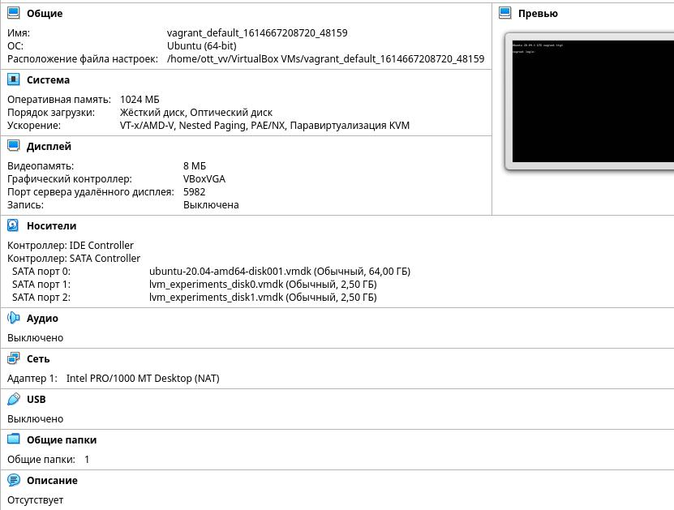

1. :))

2. Ссылка имеет те же права доступа и номер inode, что и исходный файл. При изменении разрешений файла изменятся права ссылки.  

3. 

4. fdisk  

       root@vagrant:/home/vagrant# lsblk
       NAME                 MAJ:MIN RM  SIZE RO TYPE MOUNTPOINT
       sda                    8:0    0   64G  0 disk 
       ├─sda1                 8:1    0  512M  0 part /boot/efi
       ├─sda2                 8:2    0    1K  0 part 
       └─sda5                 8:5    0 63.5G  0 part 
       ├─vgvagrant-root   253:0    0 62.6G  0 lvm  /
       └─vgvagrant-swap_1 253:1    0  980M  0 lvm  [SWAP]
       sdb                    8:16   0  2.5G  0 disk 
       ├─sdb1                 8:17   0    2G  0 part 
       └─sdb2                 8:18   0  511M  0 part 
       sdc                    8:32   0  2.5G  0 disk 
   
5. sfdisk  

        root@vagrant:/home/vagrant# sfdisk -d /dev/sdb | sfdisk /dev/sdc
        Checking that no-one is using this disk right now ... OK
        
        Disk /dev/sdc: 2.51 GiB, 2684354560 bytes, 5242880 sectors
        Disk model: VBOX HARDDISK   
        Units: sectors of 1 * 512 = 512 bytes
        Sector size (logical/physical): 512 bytes / 512 bytes
        I/O size (minimum/optimal): 512 bytes / 512 bytes
        
        >>> Script header accepted.
        >>> Script header accepted.
        >>> Script header accepted.
        >>> Script header accepted.
        >>> Created a new DOS disklabel with disk identifier 0x9bb2499c.
        /dev/sdc1: Created a new partition 1 of type 'Linux' and of size 2 GiB.
        /dev/sdc2: Created a new partition 2 of type 'Linux' and of size 511 MiB.
        /dev/sdc3: Done.
        
        New situation:
        Disklabel type: dos
        Disk identifier: 0x9bb2499c
        
        Device     Boot   Start     End Sectors  Size Id Type
        /dev/sdc1          2048 4196351 4194304    2G 83 Linux
        /dev/sdc2       4196352 5242879 1046528  511M 83 Linux
        
        The partition table has been altered.
        Calling ioctl() to re-read partition table.
        Syncing disks.

6. RAID1

        root@vagrant:/home/vagrant# lsblk
        NAME                 MAJ:MIN RM  SIZE RO TYPE MOUNTPOINT
        sda                    8:0    0   64G  0 disk 
        ├─sda1                 8:1    0  512M  0 part /boot/efi
        ├─sda2                 8:2    0    1K  0 part 
        └─sda5                 8:5    0 63.5G  0 part 
          ├─vgvagrant-root   253:0    0 62.6G  0 lvm  /
          └─vgvagrant-swap_1 253:1    0  980M  0 lvm  [SWAP]
        sdb                    8:16   0  2.5G  0 disk 
        ├─sdb1                 8:17   0    2G  0 part 
        └─sdb2                 8:18   0  511M  0 part 
        sdc                    8:32   0  2.5G  0 disk 
        ├─sdc1                 8:33   0    2G  0 part 
        └─sdc2                 8:34   0  511M  0 part 
        root@vagrant:/home/vagrant# mdadm --create --verbose /dev/md0 --level=1 --raid-devices=2 /dev/sdb1 /dev/sdc1
        root@vagrant:/home/vagrant# mdadm --create --verbose /dev/md0 --level=1 --raid-devices=2 /dev/sdb1 /dev/sdc1
        mdadm: Note: this array has metadata at the start and
            may not be suitable as a boot device.  If you plan to
            store '/boot' on this device please ensure that
            your boot-loader understands md/v1.x metadata, or use
            --metadata=0.90
        mdadm: size set to 2094080K
        Continue creating array? yes
        mdadm: Defaulting to version 1.2 metadata
        mdadm: array /dev/md0 started.

7. RAID0 

        root@vagrant:/home/vagrant# mdadm --create --verbose /dev/md1 --level=0 --raid-devices=2 /dev/sdb2 /dev/sdc2
        mdadm: chunk size defaults to 512K
        mdadm: Defaulting to version 1.2 metadata
        mdadm: array /dev/md1 started.
        root@vagrant:/home/vagrant# lsblk
        NAME                 MAJ:MIN RM  SIZE RO TYPE  MOUNTPOINT
        sda                    8:0    0   64G  0 disk  
        ├─sda1                 8:1    0  512M  0 part  /boot/efi
        ├─sda2                 8:2    0    1K  0 part  
        └─sda5                 8:5    0 63.5G  0 part  
          ├─vgvagrant-root   253:0    0 62.6G  0 lvm   /
          └─vgvagrant-swap_1 253:1    0  980M  0 lvm   [SWAP]
        sdb                    8:16   0  2.5G  0 disk  
        ├─sdb1                 8:17   0    2G  0 part  
        │ └─md0                9:0    0    2G  0 raid1 
        └─sdb2                 8:18   0  511M  0 part  
          └─md1                9:1    0 1018M  0 raid0 
        sdc                    8:32   0  2.5G  0 disk  
        ├─sdc1                 8:33   0    2G  0 part  
        │ └─md0                9:0    0    2G  0 raid1 
        └─sdc2                 8:34   0  511M  0 part  
          └─md1                9:1    0 1018M  0 raid0 

8.  pvcreate 

         root@vagrant:/home/vagrant# pvcreate /dev/md0
           Physical volume "/dev/md0" successfully created.
         root@vagrant:/home/vagrant# pvcreate /dev/md1
           Physical volume "/dev/md1" successfully created.
         root@vagrant:/home/vagrant# pvdisplay
           --- Physical volume ---
           PV Name               /dev/sda5
           VG Name               vgvagrant
           PV Size               <63.50 GiB / not usable 0   
           Allocatable           yes (but full)
           PE Size               4.00 MiB
           Total PE              16255
           Free PE               0
           Allocated PE          16255
           PV UUID               OCbATH-NO0a-4yCv-lVyW-UOYQ-uFJm-DPdN8c
            
           "/dev/md0" is a new physical volume of "<2.00 GiB"
           --- NEW Physical volume ---
           PV Name               /dev/md0
           VG Name               
           PV Size               <2.00 GiB
           Allocatable           NO
           PE Size               0   
           Total PE              0
           Free PE               0
           Allocated PE          0
           PV UUID               QP7Ph6-d5Ck-eX6B-8sYe-WdMS-Kk07-v99b1y
            
           "/dev/md1" is a new physical volume of "1018.00 MiB"
           --- NEW Physical volume ---
           PV Name               /dev/md1
           VG Name               
           PV Size               1018.00 MiB
           Allocatable           NO
           PE Size               0   
           Total PE              0
           Free PE               0
           Allocated PE          0
           PV UUID               xMYpen-7rCh-0yjM-xcdA-EUUy-t1zy-LqNyPY

9.  vgcreate  

            root@vagrant:/home/vagrant# vgcreate myvggroup /dev/md0 /dev/md1
            Volume group "myvggroup" successfully created
10. lvcreate

            root@vagrant:/home/vagrant#lvcreate -n mylv -L100M /dev/myvggroup /dev/md1

11. mkfs.ext4

         root@vagrant:/home/vagrant# mkfs.ext4 /dev/myvggroup/mylv
         mke2fs 1.45.5 (07-Jan-2020)
         Creating filesystem with 25600 4k blocks and 25600 inodes
         
         Allocating group tables: done                            
         Writing inode tables: done                            
         Creating journal (1024 blocks): done
         Writing superblocks and filesystem accounting information: done
         
12. mount
         
         root@vagrant:/home/vagrant# mkdir /new
         root@vagrant:/home/vagrant# mount /dev/myvggroup/mylv /new
    
13. wget

         root@vagrant:/home/vagrant# wget https://mirror.yandex.ru/ubuntu/ls-lR.gz -O /new/test.gz
         root@vagrant:/home/vagrant# ls /new
         test.gz
14.  lsblk

         root@vagrant:/home/vagrant# lsblk
         NAME                 MAJ:MIN RM  SIZE RO TYPE  MOUNTPOINT
         sda                    8:0    0   64G  0 disk  
         ├─sda1                 8:1    0  512M  0 part  /boot/efi
         ├─sda2                 8:2    0    1K  0 part  
         └─sda5                 8:5    0 63.5G  0 part  
           ├─vgvagrant-root   253:0    0 62.6G  0 lvm   /
           └─vgvagrant-swap_1 253:1    0  980M  0 lvm   [SWAP]
         sdb                    8:16   0  2.5G  0 disk  
         ├─sdb1                 8:17   0    2G  0 part  
         │ └─md0                9:0    0    2G  0 raid1 
         └─sdb2                 8:18   0  511M  0 part  
           └─md1                9:1    0 1018M  0 raid0 
             └─myvggroup-mylv 253:2    0  100M  0 lvm   /new
         sdc                    8:32   0  2.5G  0 disk  
         ├─sdc1                 8:33   0    2G  0 part  
         │ └─md0                9:0    0    2G  0 raid1 
         └─sdc2                 8:34   0  511M  0 part  
           └─md1                9:1    0 1018M  0 raid0 
             └─myvggroup-mylv 253:2    0  100M  0 lvm   /new

15. Тест файла
            
        root@vagrant:/home/vagrant# gzip -t /new/test.gz
        root@vagrant:/home/vagrant# echo $?
        0

16. pvmove

1. :))

2. Ссылка имеет те же права доступа и номер inode, что и исходный файл. При изменении разрешений файла изменятся права ссылки.  

3. 

4. fdisk  

       root@vagrant:/home/vagrant# lsblk
       NAME                 MAJ:MIN RM  SIZE RO TYPE MOUNTPOINT
       sda                    8:0    0   64G  0 disk 
       ├─sda1                 8:1    0  512M  0 part /boot/efi
       ├─sda2                 8:2    0    1K  0 part 
       └─sda5                 8:5    0 63.5G  0 part 
       ├─vgvagrant-root   253:0    0 62.6G  0 lvm  /
       └─vgvagrant-swap_1 253:1    0  980M  0 lvm  [SWAP]
       sdb                    8:16   0  2.5G  0 disk 
       ├─sdb1                 8:17   0    2G  0 part 
       └─sdb2                 8:18   0  511M  0 part 
       sdc                    8:32   0  2.5G  0 disk 
   
5. sfdisk  

        root@vagrant:/home/vagrant# sfdisk -d /dev/sdb | sfdisk /dev/sdc
        Checking that no-one is using this disk right now ... OK
        
        Disk /dev/sdc: 2.51 GiB, 2684354560 bytes, 5242880 sectors
        Disk model: VBOX HARDDISK   
        Units: sectors of 1 * 512 = 512 bytes
        Sector size (logical/physical): 512 bytes / 512 bytes
        I/O size (minimum/optimal): 512 bytes / 512 bytes
        
        >>> Script header accepted.
        >>> Script header accepted.
        >>> Script header accepted.
        >>> Script header accepted.
        >>> Created a new DOS disklabel with disk identifier 0x9bb2499c.
        /dev/sdc1: Created a new partition 1 of type 'Linux' and of size 2 GiB.
        /dev/sdc2: Created a new partition 2 of type 'Linux' and of size 511 MiB.
        /dev/sdc3: Done.
        
        New situation:
        Disklabel type: dos
        Disk identifier: 0x9bb2499c
        
        Device     Boot   Start     End Sectors  Size Id Type
        /dev/sdc1          2048 4196351 4194304    2G 83 Linux
        /dev/sdc2       4196352 5242879 1046528  511M 83 Linux
        
        The partition table has been altered.
        Calling ioctl() to re-read partition table.
        Syncing disks.

6. RAID1

        root@vagrant:/home/vagrant# lsblk
        NAME                 MAJ:MIN RM  SIZE RO TYPE MOUNTPOINT
        sda                    8:0    0   64G  0 disk 
        ├─sda1                 8:1    0  512M  0 part /boot/efi
        ├─sda2                 8:2    0    1K  0 part 
        └─sda5                 8:5    0 63.5G  0 part 
          ├─vgvagrant-root   253:0    0 62.6G  0 lvm  /
          └─vgvagrant-swap_1 253:1    0  980M  0 lvm  [SWAP]
        sdb                    8:16   0  2.5G  0 disk 
        ├─sdb1                 8:17   0    2G  0 part 
        └─sdb2                 8:18   0  511M  0 part 
        sdc                    8:32   0  2.5G  0 disk 
        ├─sdc1                 8:33   0    2G  0 part 
        └─sdc2                 8:34   0  511M  0 part 
        root@vagrant:/home/vagrant# mdadm --create --verbose /dev/md0 --level=1 --raid-devices=2 /dev/sdb1 /dev/sdc1
        root@vagrant:/home/vagrant# mdadm --create --verbose /dev/md0 --level=1 --raid-devices=2 /dev/sdb1 /dev/sdc1
        mdadm: Note: this array has metadata at the start and
            may not be suitable as a boot device.  If you plan to
            store '/boot' on this device please ensure that
            your boot-loader understands md/v1.x metadata, or use
            --metadata=0.90
        mdadm: size set to 2094080K
        Continue creating array? yes
        mdadm: Defaulting to version 1.2 metadata
        mdadm: array /dev/md0 started.

7. RAID0 

        root@vagrant:/home/vagrant# mdadm --create --verbose /dev/md1 --level=0 --raid-devices=2 /dev/sdb2 /dev/sdc2
        mdadm: chunk size defaults to 512K
        mdadm: Defaulting to version 1.2 metadata
        mdadm: array /dev/md1 started.
        root@vagrant:/home/vagrant# lsblk
        NAME                 MAJ:MIN RM  SIZE RO TYPE  MOUNTPOINT
        sda                    8:0    0   64G  0 disk  
        ├─sda1                 8:1    0  512M  0 part  /boot/efi
        ├─sda2                 8:2    0    1K  0 part  
        └─sda5                 8:5    0 63.5G  0 part  
          ├─vgvagrant-root   253:0    0 62.6G  0 lvm   /
          └─vgvagrant-swap_1 253:1    0  980M  0 lvm   [SWAP]
        sdb                    8:16   0  2.5G  0 disk  
        ├─sdb1                 8:17   0    2G  0 part  
        │ └─md0                9:0    0    2G  0 raid1 
        └─sdb2                 8:18   0  511M  0 part  
          └─md1                9:1    0 1018M  0 raid0 
        sdc                    8:32   0  2.5G  0 disk  
        ├─sdc1                 8:33   0    2G  0 part  
        │ └─md0                9:0    0    2G  0 raid1 
        └─sdc2                 8:34   0  511M  0 part  
          └─md1                9:1    0 1018M  0 raid0 

8.  pvcreate 

         root@vagrant:/home/vagrant# pvcreate /dev/md0
           Physical volume "/dev/md0" successfully created.
         root@vagrant:/home/vagrant# pvcreate /dev/md1
           Physical volume "/dev/md1" successfully created.
         root@vagrant:/home/vagrant# pvdisplay
           --- Physical volume ---
           PV Name               /dev/sda5
           VG Name               vgvagrant
           PV Size               <63.50 GiB / not usable 0   
           Allocatable           yes (but full)
           PE Size               4.00 MiB
           Total PE              16255
           Free PE               0
           Allocated PE          16255
           PV UUID               OCbATH-NO0a-4yCv-lVyW-UOYQ-uFJm-DPdN8c
            
           "/dev/md0" is a new physical volume of "<2.00 GiB"
           --- NEW Physical volume ---
           PV Name               /dev/md0
           VG Name               
           PV Size               <2.00 GiB
           Allocatable           NO
           PE Size               0   
           Total PE              0
           Free PE               0
           Allocated PE          0
           PV UUID               QP7Ph6-d5Ck-eX6B-8sYe-WdMS-Kk07-v99b1y
            
           "/dev/md1" is a new physical volume of "1018.00 MiB"
           --- NEW Physical volume ---
           PV Name               /dev/md1
           VG Name               
           PV Size               1018.00 MiB
           Allocatable           NO
           PE Size               0   
           Total PE              0
           Free PE               0
           Allocated PE          0
           PV UUID               xMYpen-7rCh-0yjM-xcdA-EUUy-t1zy-LqNyPY

9.  vgcreate  

            root@vagrant:/home/vagrant# vgcreate myvggroup /dev/md0 /dev/md1
            Volume group "myvggroup" successfully created
10. lvcreate

            root@vagrant:/home/vagrant#lvcreate -n mylv -L100M /dev/myvggroup /dev/md1

11. mkfs.ext4

         root@vagrant:/home/vagrant# mkfs.ext4 /dev/myvggroup/mylv
         mke2fs 1.45.5 (07-Jan-2020)
         Creating filesystem with 25600 4k blocks and 25600 inodes
         
         Allocating group tables: done                            
         Writing inode tables: done                            
         Creating journal (1024 blocks): done
         Writing superblocks and filesystem accounting information: done
         
12. mount
         
         root@vagrant:/home/vagrant# mkdir /new
         root@vagrant:/home/vagrant# mount /dev/myvggroup/mylv /new
    
13. wget

         root@vagrant:/home/vagrant# wget https://mirror.yandex.ru/ubuntu/ls-lR.gz -O /new/test.gz
         root@vagrant:/home/vagrant# ls /new
         test.gz
14.  lsblk

         root@vagrant:/home/vagrant# lsblk
         NAME                 MAJ:MIN RM  SIZE RO TYPE  MOUNTPOINT
         sda                    8:0    0   64G  0 disk  
         ├─sda1                 8:1    0  512M  0 part  /boot/efi
         ├─sda2                 8:2    0    1K  0 part  
         └─sda5                 8:5    0 63.5G  0 part  
           ├─vgvagrant-root   253:0    0 62.6G  0 lvm   /
           └─vgvagrant-swap_1 253:1    0  980M  0 lvm   [SWAP]
         sdb                    8:16   0  2.5G  0 disk  
         ├─sdb1                 8:17   0    2G  0 part  
         │ └─md0                9:0    0    2G  0 raid1 
         └─sdb2                 8:18   0  511M  0 part  
           └─md1                9:1    0 1018M  0 raid0 
             └─myvggroup-mylv 253:2    0  100M  0 lvm   /new
         sdc                    8:32   0  2.5G  0 disk  
         ├─sdc1                 8:33   0    2G  0 part  
         │ └─md0                9:0    0    2G  0 raid1 
         └─sdc2                 8:34   0  511M  0 part  
           └─md1                9:1    0 1018M  0 raid0 
             └─myvggroup-mylv 253:2    0  100M  0 lvm   /new

15. Тест файла
            
        root@vagrant:/home/vagrant# gzip -t /new/test.gz
        root@vagrant:/home/vagrant# echo $?
        0

16. pvmove

1. :))

2. Ссылка имеет те же права доступа и номер inode, что и исходный файл. При изменении разрешений файла изменятся права ссылки.  

3. 

4. fdisk  

       root@vagrant:/home/vagrant# lsblk
       NAME                 MAJ:MIN RM  SIZE RO TYPE MOUNTPOINT
       sda                    8:0    0   64G  0 disk 
       ├─sda1                 8:1    0  512M  0 part /boot/efi
       ├─sda2                 8:2    0    1K  0 part 
       └─sda5                 8:5    0 63.5G  0 part 
       ├─vgvagrant-root   253:0    0 62.6G  0 lvm  /
       └─vgvagrant-swap_1 253:1    0  980M  0 lvm  [SWAP]
       sdb                    8:16   0  2.5G  0 disk 
       ├─sdb1                 8:17   0    2G  0 part 
       └─sdb2                 8:18   0  511M  0 part 
       sdc                    8:32   0  2.5G  0 disk 
   
5. sfdisk  

        root@vagrant:/home/vagrant# sfdisk -d /dev/sdb | sfdisk /dev/sdc
        Checking that no-one is using this disk right now ... OK
        
        Disk /dev/sdc: 2.51 GiB, 2684354560 bytes, 5242880 sectors
        Disk model: VBOX HARDDISK   
        Units: sectors of 1 * 512 = 512 bytes
        Sector size (logical/physical): 512 bytes / 512 bytes
        I/O size (minimum/optimal): 512 bytes / 512 bytes
        
        >>> Script header accepted.
        >>> Script header accepted.
        >>> Script header accepted.
        >>> Script header accepted.
        >>> Created a new DOS disklabel with disk identifier 0x9bb2499c.
        /dev/sdc1: Created a new partition 1 of type 'Linux' and of size 2 GiB.
        /dev/sdc2: Created a new partition 2 of type 'Linux' and of size 511 MiB.
        /dev/sdc3: Done.
        
        New situation:
        Disklabel type: dos
        Disk identifier: 0x9bb2499c
        
        Device     Boot   Start     End Sectors  Size Id Type
        /dev/sdc1          2048 4196351 4194304    2G 83 Linux
        /dev/sdc2       4196352 5242879 1046528  511M 83 Linux
        
        The partition table has been altered.
        Calling ioctl() to re-read partition table.
        Syncing disks.

6. RAID1

        root@vagrant:/home/vagrant# lsblk
        NAME                 MAJ:MIN RM  SIZE RO TYPE MOUNTPOINT
        sda                    8:0    0   64G  0 disk 
        ├─sda1                 8:1    0  512M  0 part /boot/efi
        ├─sda2                 8:2    0    1K  0 part 
        └─sda5                 8:5    0 63.5G  0 part 
          ├─vgvagrant-root   253:0    0 62.6G  0 lvm  /
          └─vgvagrant-swap_1 253:1    0  980M  0 lvm  [SWAP]
        sdb                    8:16   0  2.5G  0 disk 
        ├─sdb1                 8:17   0    2G  0 part 
        └─sdb2                 8:18   0  511M  0 part 
        sdc                    8:32   0  2.5G  0 disk 
        ├─sdc1                 8:33   0    2G  0 part 
        └─sdc2                 8:34   0  511M  0 part 
        root@vagrant:/home/vagrant# mdadm --create --verbose /dev/md0 --level=1 --raid-devices=2 /dev/sdb1 /dev/sdc1
        root@vagrant:/home/vagrant# mdadm --create --verbose /dev/md0 --level=1 --raid-devices=2 /dev/sdb1 /dev/sdc1
        mdadm: Note: this array has metadata at the start and
            may not be suitable as a boot device.  If you plan to
            store '/boot' on this device please ensure that
            your boot-loader understands md/v1.x metadata, or use
            --metadata=0.90
        mdadm: size set to 2094080K
        Continue creating array? yes
        mdadm: Defaulting to version 1.2 metadata
        mdadm: array /dev/md0 started.

7. RAID0 

        root@vagrant:/home/vagrant# mdadm --create --verbose /dev/md1 --level=0 --raid-devices=2 /dev/sdb2 /dev/sdc2
        mdadm: chunk size defaults to 512K
        mdadm: Defaulting to version 1.2 metadata
        mdadm: array /dev/md1 started.
        root@vagrant:/home/vagrant# lsblk
        NAME                 MAJ:MIN RM  SIZE RO TYPE  MOUNTPOINT
        sda                    8:0    0   64G  0 disk  
        ├─sda1                 8:1    0  512M  0 part  /boot/efi
        ├─sda2                 8:2    0    1K  0 part  
        └─sda5                 8:5    0 63.5G  0 part  
          ├─vgvagrant-root   253:0    0 62.6G  0 lvm   /
          └─vgvagrant-swap_1 253:1    0  980M  0 lvm   [SWAP]
        sdb                    8:16   0  2.5G  0 disk  
        ├─sdb1                 8:17   0    2G  0 part  
        │ └─md0                9:0    0    2G  0 raid1 
        └─sdb2                 8:18   0  511M  0 part  
          └─md1                9:1    0 1018M  0 raid0 
        sdc                    8:32   0  2.5G  0 disk  
        ├─sdc1                 8:33   0    2G  0 part  
        │ └─md0                9:0    0    2G  0 raid1 
        └─sdc2                 8:34   0  511M  0 part  
          └─md1                9:1    0 1018M  0 raid0 

8.  pvcreate 

         root@vagrant:/home/vagrant# pvcreate /dev/md0
           Physical volume "/dev/md0" successfully created.
         root@vagrant:/home/vagrant# pvcreate /dev/md1
           Physical volume "/dev/md1" successfully created.
         root@vagrant:/home/vagrant# pvdisplay
           --- Physical volume ---
           PV Name               /dev/sda5
           VG Name               vgvagrant
           PV Size               <63.50 GiB / not usable 0   
           Allocatable           yes (but full)
           PE Size               4.00 MiB
           Total PE              16255
           Free PE               0
           Allocated PE          16255
           PV UUID               OCbATH-NO0a-4yCv-lVyW-UOYQ-uFJm-DPdN8c
            
           "/dev/md0" is a new physical volume of "<2.00 GiB"
           --- NEW Physical volume ---
           PV Name               /dev/md0
           VG Name               
           PV Size               <2.00 GiB
           Allocatable           NO
           PE Size               0   
           Total PE              0
           Free PE               0
           Allocated PE          0
           PV UUID               QP7Ph6-d5Ck-eX6B-8sYe-WdMS-Kk07-v99b1y
            
           "/dev/md1" is a new physical volume of "1018.00 MiB"
           --- NEW Physical volume ---
           PV Name               /dev/md1
           VG Name               
           PV Size               1018.00 MiB
           Allocatable           NO
           PE Size               0   
           Total PE              0
           Free PE               0
           Allocated PE          0
           PV UUID               xMYpen-7rCh-0yjM-xcdA-EUUy-t1zy-LqNyPY

9.  vgcreate  

            root@vagrant:/home/vagrant# vgcreate myvggroup /dev/md0 /dev/md1
            Volume group "myvggroup" successfully created
10. lvcreate

            root@vagrant:/home/vagrant#lvcreate -n mylv -L100M /dev/myvggroup /dev/md1

11. mkfs.ext4

         root@vagrant:/home/vagrant# mkfs.ext4 /dev/myvggroup/mylv
         mke2fs 1.45.5 (07-Jan-2020)
         Creating filesystem with 25600 4k blocks and 25600 inodes
         
         Allocating group tables: done                            
         Writing inode tables: done                            
         Creating journal (1024 blocks): done
         Writing superblocks and filesystem accounting information: done
         
12. mount
         
         root@vagrant:/home/vagrant# mkdir /new
         root@vagrant:/home/vagrant# mount /dev/myvggroup/mylv /new
    
13. wget

         root@vagrant:/home/vagrant# wget https://mirror.yandex.ru/ubuntu/ls-lR.gz -O /new/test.gz
         root@vagrant:/home/vagrant# ls /new
         test.gz
14.  lsblk

         root@vagrant:/home/vagrant# lsblk
         NAME                 MAJ:MIN RM  SIZE RO TYPE  MOUNTPOINT
         sda                    8:0    0   64G  0 disk  
         ├─sda1                 8:1    0  512M  0 part  /boot/efi
         ├─sda2                 8:2    0    1K  0 part  
         └─sda5                 8:5    0 63.5G  0 part  
           ├─vgvagrant-root   253:0    0 62.6G  0 lvm   /
           └─vgvagrant-swap_1 253:1    0  980M  0 lvm   [SWAP]
         sdb                    8:16   0  2.5G  0 disk  
         ├─sdb1                 8:17   0    2G  0 part  
         │ └─md0                9:0    0    2G  0 raid1 
         └─sdb2                 8:18   0  511M  0 part  
           └─md1                9:1    0 1018M  0 raid0 
             └─myvggroup-mylv 253:2    0  100M  0 lvm   /new
         sdc                    8:32   0  2.5G  0 disk  
         ├─sdc1                 8:33   0    2G  0 part  
         │ └─md0                9:0    0    2G  0 raid1 
         └─sdc2                 8:34   0  511M  0 part  
           └─md1                9:1    0 1018M  0 raid0 
             └─myvggroup-mylv 253:2    0  100M  0 lvm   /new

15. Тест файла
            
        root@vagrant:/home/vagrant# gzip -t /new/test.gz
        root@vagrant:/home/vagrant# echo $?
        0

16. pvmove

        root@vagrant:/home/vagrant# pvmove -n mylv -b /dev/md1
        root@vagrant:/home/vagrant# lsblk
        NAME                 MAJ:MIN RM  SIZE RO TYPE  MOUNTPOINT
        sda                    8:0    0   64G  0 disk  
        ├─sda1                 8:1    0  512M  0 part  /boot/efi
        ├─sda2                 8:2    0    1K  0 part  
        └─sda5                 8:5    0 63.5G  0 part  
          ├─vgvagrant-root   253:0    0 62.6G  0 lvm   /
          └─vgvagrant-swap_1 253:1    0  980M  0 lvm   [SWAP]
        sdb                    8:16   0  2.5G  0 disk  
        ├─sdb1                 8:17   0    2G  0 part  
        │ └─md0                9:0    0    2G  0 raid1 
        │   └─myvggroup-mylv 253:2    0  100M  0 lvm   /new
        └─sdb2                 8:18   0  511M  0 part  
          └─md1                9:1    0 1018M  0 raid0 
        sdc                    8:32   0  2.5G  0 disk  
        ├─sdc1                 8:33   0    2G  0 part  
        │ └─md0                9:0    0    2G  0 raid1 
        │   └─myvggroup-mylv 253:2    0  100M  0 lvm   /new
        └─sdc2                 8:34   0  511M  0 part  
          └─md1                9:1    0 1018M  0 raid0 

17. --fail

        root@vagrant:/home/vagrant# mdadm /dev/md0 --fail /dev/sdc1
        mdadm: set /dev/sdc1 faulty in /dev/md0

18. dmesg

        root@vagrant:/home/vagrant# dmesg | grep raid1
        [56350.626882] md/raid1:md0: not clean -- starting background reconstruction
        [56350.626884] md/raid1:md0: active with 2 out of 2 mirrors
        [88829.263567] md/raid1:md0: Disk failure on sdc1, disabling device.
                       md/raid1:md0: Operation continuing on 1 devices.

19. test

        root@vagrant:/home/vagrant# gzip -t /new/test.gz && echo $?
        0

20. vagrant destroy

        vagrant destroy
            default: Are you sure you want to destroy the 'default' VM? [y/N] y
        ==> default: Forcing shutdown of VM...
        ==> default: Destroying VM and associated drives...