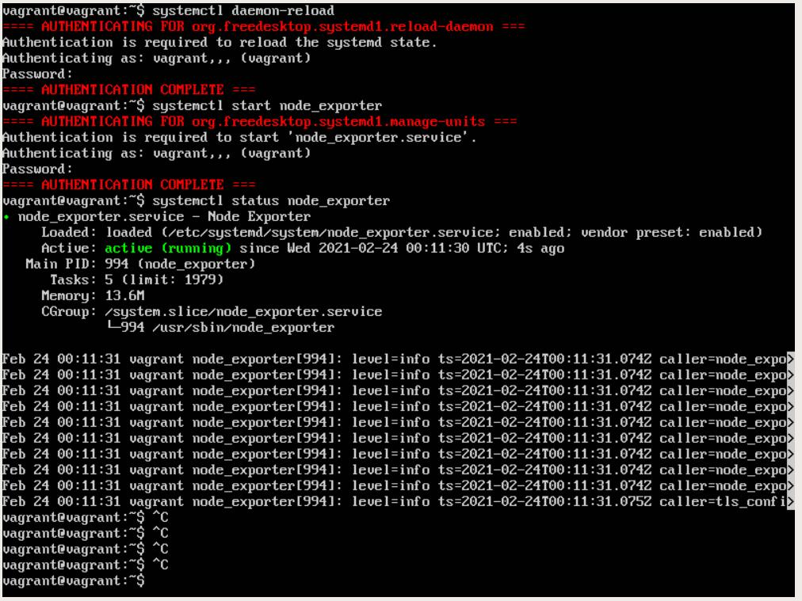
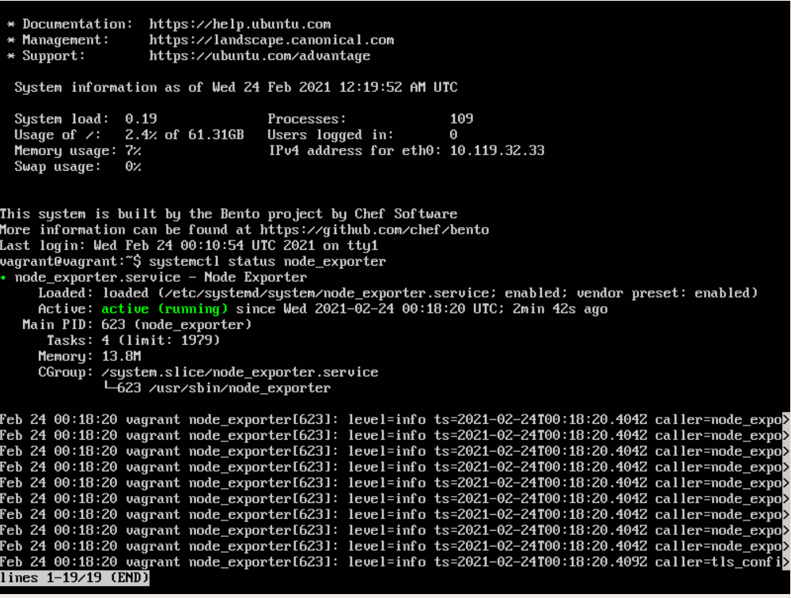
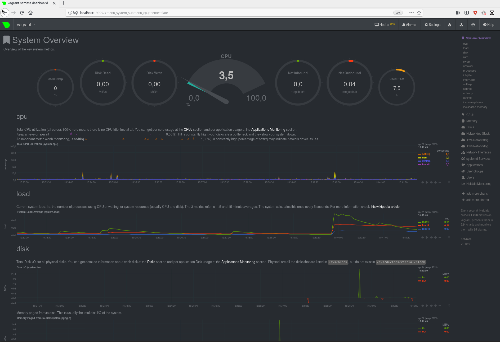
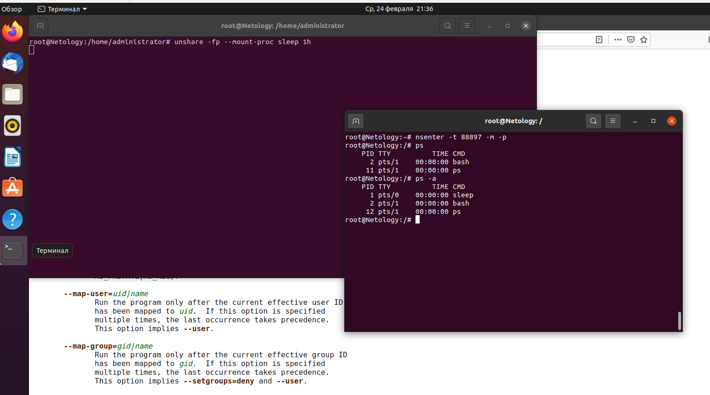

1. node_exporter.service
   
        [Unit]
        Description=Node Exporter
        
        [Service]
        User=vagrant
        EnvironmentFile=/etc/sysconfig/node_exporter
        ExecStart=/usr/sbin/node_exporter $OPTIONS
        
        [Install]
        WantedBy=multi-user.target

Установлен как сервис

После перезагрузки

2. node_cpu_seconds_total  
node_filesystem_avail_bytes  
   node_network_receive_bytes_total  
   node_memory_MemAvailable_bytes
   node_memory_MemTotal_bytes
   

3.

4. Можно, по systemd detected virtualization

        vagrant@vagrant:~$ dmesg | grep -i virtual 
        [    0.000000] DMI: innotek GmbH VirtualBox/VirtualBox, BIOS VirtualBox 12/01/2006
        [    0.003815] CPU MTRRs all blank - virtualized system.
        [    0.122269] Booting paravirtualized kernel on KVM
        [    3.018667] systemd[1]: Detected virtualization oracle.
   
5.sysctl -n fs.nr_open лимит, по умолчанию, на количество открытых дескрипторов файла, ulimit -n лимит не позволит достичь такого числа

6. 

7. :(){ :|:& };: - fork - бомба
в системе испульзуется pids controller - ограничение максимального количества симуляционных процессов 
   cgroup ? ограничивающий нагрузку на прцессор. 
