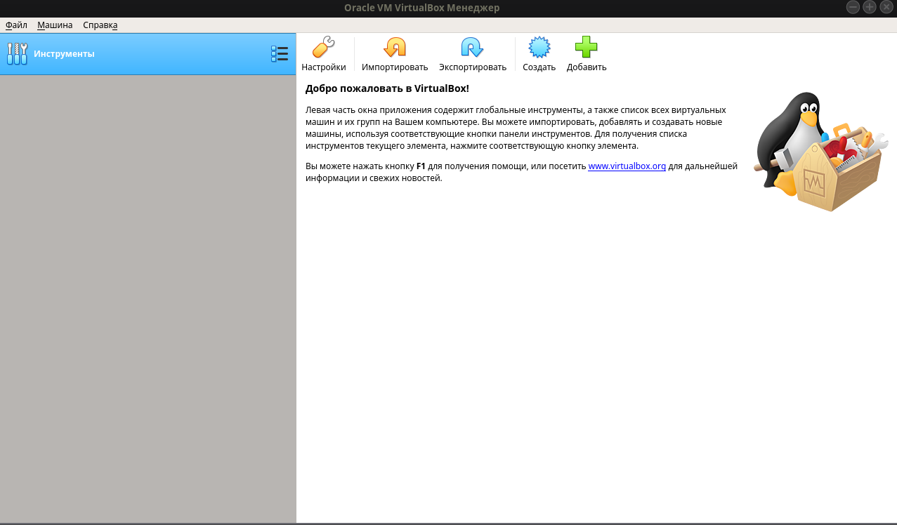
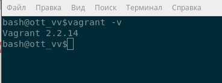
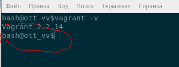
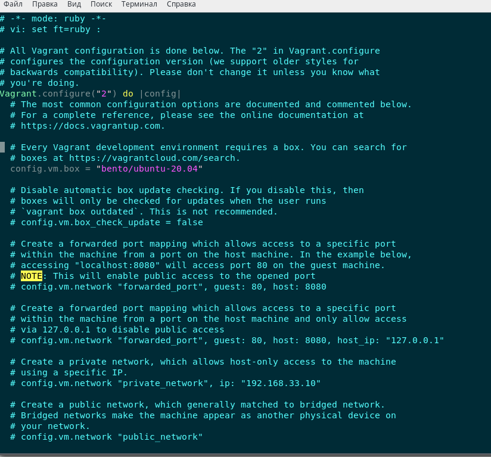
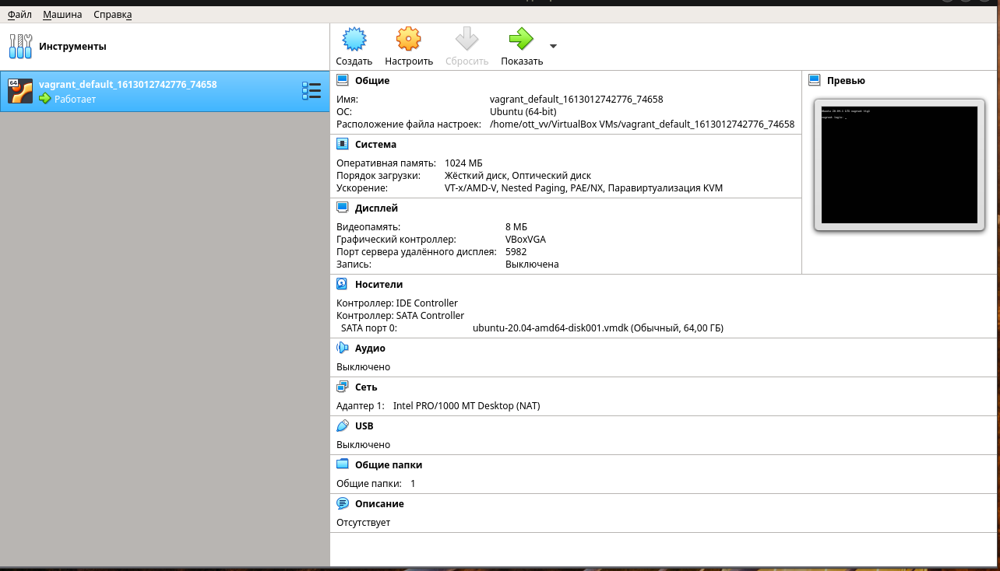
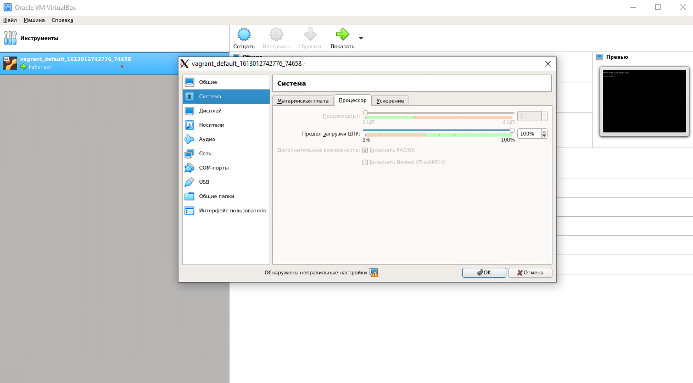
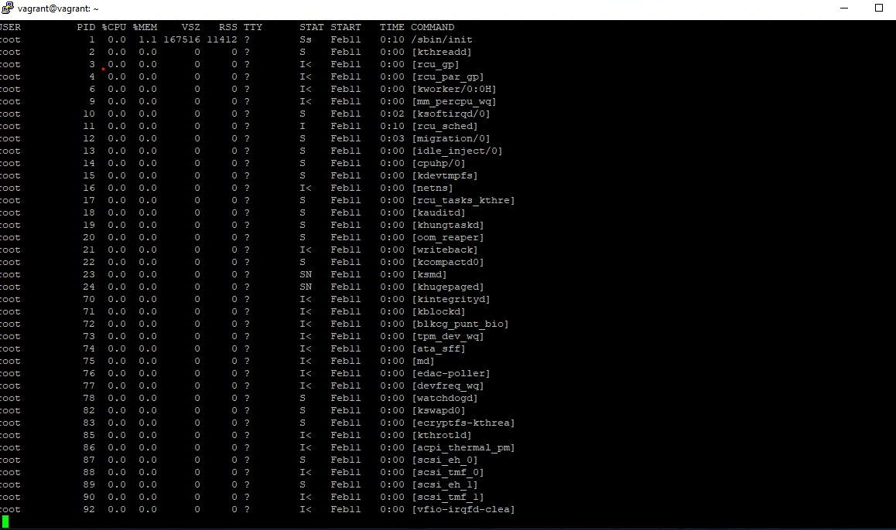

<<<<<<< HEAD
1. VirtualBox 
   

   

2. Vagrant:
   

3. Custom Terminal

4. Ubuntu 20.04 run

5. Ubuntu 20.04

6. Из аппаратных ресурсов по умолчанию предоставлен 1 процессор (1 ядро)
   Выделены 1024 Мб(1 Гб) Оперативной памяти 
   

7.Вывод ps -aux на установленой убунте

8. a)
home_work$ man bash | nl | grep -i histsize
   428                shell exits.  If the value is 0, the history file is truncated to zero size.  Non-numeric values and numeric values less than zero inhibit truncation.  The shell sets the default value to the value of HISTSIZE after reading any startup files.
   433         HISTSIZE
  1189                value of the HISTSIZE shell variable.  If an attempt is made to set history-size to a non-numeric value, the maximum number of history entries will be set to 500.
  1553         When the -o history option to the set builtin is enabled, the shell provides access to the command history, the list of commands previously typed.  The value of the HISTSIZE variable is used as the number of commands to save in a history list.  The text of the last HISTSIZE commands (default  500)  is  1557         tionally  displayed depending on the value of the HISTTIMEFORMAT variable.  When a shell with history enabled exits, the last $HISTSIZE lines are copied from the history list to $HISTFILE.  If the histappend shell option is enabled (see the description of shopt under SHELL BUILTIN COMMANDS below)
   b)
   ignoreboth позволяет не сохранять строки начинающиеся с символа <пробел> и не сохранять строки, совпадающие с последней выполненной командой

   530         HISTCONTROL
   531                A  colon-separated list of values controlling how commands are saved on the history list.  If the list of values includes ignorespace, lines which begin with a space character
   532                are not saved in the history list.  A value of ignoredups causes lines matching the previous history entry to not be saved.  A value of ignoreboth is shorthand for ignorespace
   533                and  ignoredups.  A value of erasedups causes all previous lines matching the current line to be removed from the history list before that line is saved.  Any value not in the
   534                above list is ignored.  If HISTCONTROL is unset, or does not include a valid value, all lines read by the shell parser are saved on the history list, subject to the  value  of
   535                HISTIGNORE.  The second and subsequent lines of a multi-line compound command are not tested, and are added to the history regardless of the value of HISTCONTROL.
   
9. Cкобки {} применимы в сцкенариях обработки списков
   125         { list; }
   126                list is simply executed in the current shell environment.  list must be terminated with a newline or semicolon.  This is known as a group command.  The return status is the exit status of list.  Note that unlike the metacharacters ( and ), { and } are reserved words and must occur where  a  re‐
   127                served word is permitted to be recognized.  Since they do not cause a word break, they must be separated from list by whitespace or another shell metacharacter.

10. touch {1..100000} получилось 300000

11. [[ -d /tmp ]] проверяет существует ли файл tmp и является ли директорией
    
12. 
$ mkdir /tmp/new_path_directory
$ cp /bin/bash /tmp/new_path_directory/bash
$ export PATH="/tmp/new_path_directory:$PATH"
$ type -a bash
bash is /tmp/new_path_directory/bash
bash is /usr/bin/bash
bash is /bin/bash