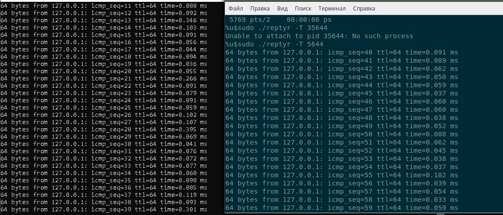

1. Команда cd встроеная в shell комманда. Встроена она из-за того что ей необходимо влиять на поведение shell'a.
   
2. grep -с <some_string> <some_file>

3. systemd c pid является родителем для всех процессов в вашей виртуальной машине Ubuntu 20.04. Почему в wsl2 initd? 
   
4. ls 2> /dev/pts/X
   
5. cat <some_file> >> some_file_2
   
6. Получится. Можно, только переключившись на ttyX, cat /dev/ttyX на работает, в отличие от /dev/pts/X 

7. bash 5>&1 приведет к созданию нового файлового дескриптора 5 b перенаправлению в него stdout. Поэтому  echo netology > /proc/$$/fd/5 выведет на терминал /dev/pts/X 
   текст netology.
   
8. Получится, 3>&2 2>&1 1>&3

9. Команда cat /proc/$$/environ выведет переменные окружения процесса , вместо нее можно использовать env.
   
10. man proc  
   /proc/[pid]/cmdline
    

    Содержит  полную  командную строку процесса, если процесс не является зомби. В последнем случае этот файл пуст, поэтому чтение из него вернёт  0  символов.  Аргументы  командной  строки  в  этом  файле представлены  в  виде  набора  строк,  разделённых байтами null ('\0') и байтом null после последней строки.

   /proc/[pid]/exe  
    

    В  ядрах  Linux  2.2  и  более поздних, этот файл является символьной ссылкой, содержащей полное имя файла выполняемой команды. Эта символьная ссылка обычно может быть разыменована; при попытке открыть её  откроется  выполняемый файл. Вы можете ввести /proc/[pid]/exe, чтобы запустить другую копию того же выполняемого файла, что выполняется системой в качестве процесса [pid]. В многонитиевых процессах содержимое  этой  символьной  ссылки  недоступно,  если  главная нить уже завершила работу (обычно с помощью вызова pthread_exit(3)).  
    В ядрах Linux 2.0 и более ранних, /proc/[pid]/exe указывает на двоичный файл, который был  выполнен, и  работает  как  символьная  ссылка.  Вызов  readlink(2)  над этим файлом в Linux 2.0 вернёт строку следующего вида:

                  [device]:inode
  
    Например, [0301]:1502 указывает на inode 1502 на устройстве со старшим номером устройства  03  (IDE,MFM, и т.п. диски), младшим номером 01 (первый раздел на первом диске).

11. grep sse /proc/cpuinfo   

      flags		: fpu vme de pse tsc msr pae mce cx8 apic sep mtrr pge mca cmov pat pse36 clflush dts acpi mmx fxsr sse sse2 ss ht tm pbe syscall nx pdpe1gb rdtscp lm constant_tsc art arch_perfmon pebs bts rep_good nopl xtopology nonstop_tsc cpuid aperfmperf tsc_known_freq pni pclmulqdq dtes64 monitor ds_cpl vmx est tm2 ssse3 sdbg fma cx16 xtpr pdcm pcid sse4_1 sse4_2 x2apic movbe popcnt tsc_deadline_timer aes xsave avx f16c rdrand lahf_lm abm 3dnowprefetch cpuid_fault epb invpcid_single pti ssbd ibrs ibpb stibp tpr_shadow vnmi flexpriority ept vpid ept_ad fsgsbase tsc_adjust bmi1 avx2 smep bmi2 erms invpcid mpx rdseed adx smap clflushopt intel_pt xsaveopt xsavec xgetbv1 xsaves dtherm arat pln pts hwp hwp_notify hwp_act_window hwp_epp flush_l1d  
      flags		: fpu vme de pse tsc msr pae mce cx8 apic sep mtrr pge mca cmov pat pse36 clflush dts acpi mmx fxsr sse sse2 ss ht tm pbe syscall nx pdpe1gb rdtscp lm constant_tsc art arch_perfmon pebs bts rep_good nopl xtopology nonstop_tsc cpuid aperfmperf tsc_known_freq pni pclmulqdq dtes64 monitor ds_cpl vmx est tm2 ssse3 sdbg fma cx16 xtpr pdcm pcid sse4_1 sse4_2 x2apic movbe popcnt tsc_deadline_timer aes xsave avx f16c rdrand lahf_lm abm 3dnowprefetch cpuid_fault epb invpcid_single pti ssbd ibrs ibpb stibp tpr_shadow vnmi flexpriority ept vpid ept_ad fsgsbase tsc_adjust bmi1 avx2 smep bmi2 erms invpcid mpx rdseed adx smap clflushopt intel_pt xsaveopt xsavec xgetbv1 xsaves dtherm arat pln pts hwp hwp_notify hwp_act_window hwp_epp flush_l1d  
      flags		: fpu vme de pse tsc msr pae mce cx8 apic sep mtrr pge mca cmov pat pse36 clflush dts acpi mmx fxsr sse sse2 ss ht tm pbe syscall nx pdpe1gb rdtscp lm constant_tsc art arch_perfmon pebs bts rep_good nopl xtopology nonstop_tsc cpuid aperfmperf tsc_known_freq pni pclmulqdq dtes64 monitor ds_cpl vmx est tm2 ssse3 sdbg fma cx16 xtpr pdcm pcid sse4_1 sse4_2 x2apic movbe popcnt tsc_deadline_timer aes xsave avx f16c rdrand lahf_lm abm 3dnowprefetch cpuid_fault epb invpcid_single pti ssbd ibrs ibpb stibp tpr_shadow vnmi flexpriority ept vpid ept_ad fsgsbase tsc_adjust bmi1 avx2 smep bmi2 erms invpcid mpx rdseed adx smap clflushopt intel_pt xsaveopt xsavec xgetbv1 xsaves dtherm arat pln pts hwp hwp_notify hwp_act_window hwp_epp flush_l1d  
      flags		: fpu vme de pse tsc msr pae mce cx8 apic sep mtrr pge mca cmov pat pse36 clflush dts acpi mmx fxsr sse sse2 ss ht tm pbe syscall nx pdpe1gb rdtscp lm constant_tsc art arch_perfmon pebs bts rep_good nopl xtopology nonstop_tsc cpuid aperfmperf tsc_known_freq pni pclmulqdq dtes64 monitor ds_cpl vmx est tm2 ssse3 sdbg fma cx16 xtpr pdcm pcid sse4_1 sse4_2 x2apic movbe popcnt tsc_deadline_timer aes xsave avx f16c rdrand lahf_lm abm 3dnowprefetch cpuid_fault epb invpcid_single pti ssbd ibrs ibpb stibp tpr_shadow vnmi flexpriority ept vpid ept_ad fsgsbase tsc_adjust bmi1 avx2 smep bmi2 erms invpcid mpx rdseed adx smap clflushopt intel_pt xsaveopt xsavec xgetbv1 xsaves dtherm arat pln pts hwp hwp_notify hwp_act_window hwp_epp flush_l1d  

Старшая версия набора инструкций SSE4.2

12. ssh -t localhost

13. 

14. Если  использовать конструкцию echo string | sudo tee /root/new_file, то stdout команды echo будет передан команде tee запущеной от имени суперпользователя, которая в свою очередь читает stdout и передает его в stdout и файл. В случае с  команда не работает, потому что перенаправление выполняется оболочкой, которая не имеет права на запись в /root/new_file, sudo tee в отличие от sudo echo создает новый процесс с правами суперпользователя.